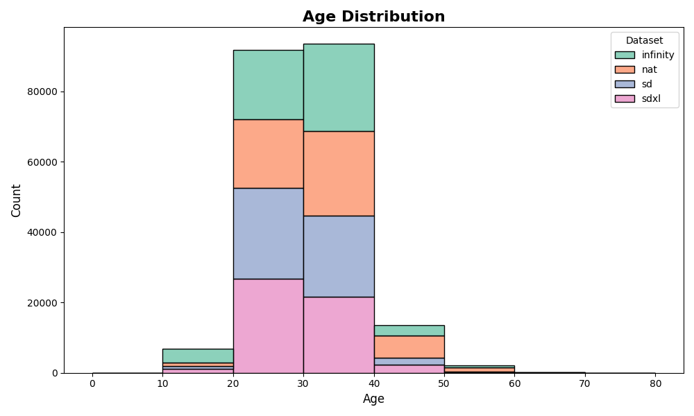
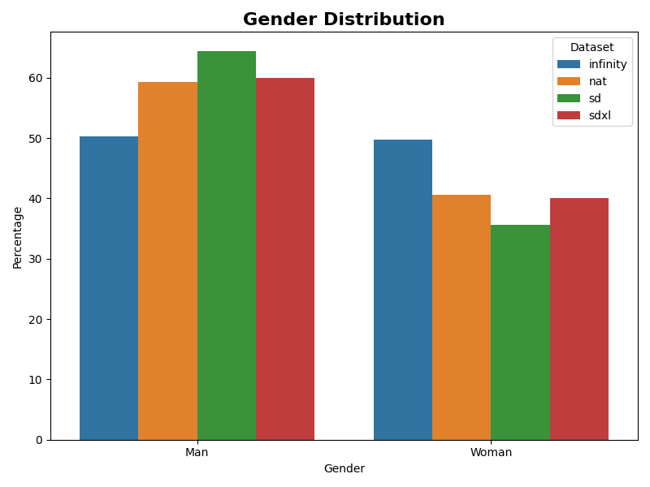
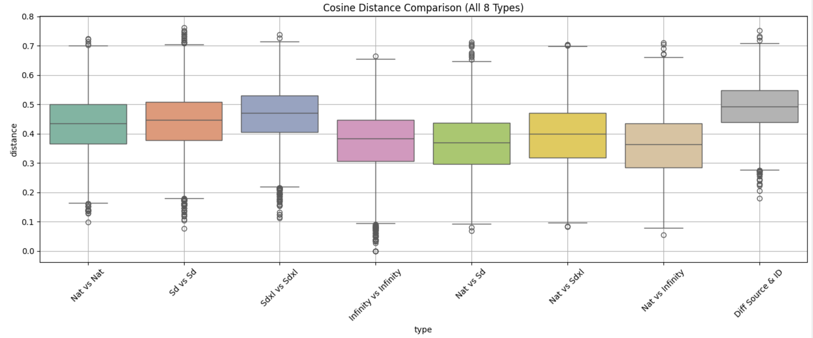

# SynMirror

**SynMirror** is a dataset constructed for research on the differences between synthetic and natural data. Captions were generated for collected natural images using Salesforce BLIP, and synthetic data was then generated using those captions with the following models:
- `stabilityai/stable-diffusion-2-1`
- `stabilityai/stable-diffusion-xl-base-1.0`
- `FoundationVision/Infinity`

## Dataset Description

Each dataset is associated with a unique ID, and all images sharing the same ID were generated from the same caption. Since the captions preserve a significant amount of information about the original natural images, each dataset exhibits relatively similar distributions in terms of metadata such as gender and age. This allows research using this dataset to be generalized to the study of differences between natural and synthetic data, without being heavily influenced by attributes like gender or age.

## Distribution Plots

Below are the gender and age distribution plots for each dataset:

**Age Distribution**  

**Gender Distribution**  

## CLIP Embedding Space Distance

The following plot shows the CLIP (openai/clip-vit-base-patch32) embedding space distance for each dataset:

If the dataset was constructed correctly according to the hypothesis, then images with the same ID—generated from the same caption—should have semantically similar content and thus lie close to each other in CLIP space. Conversely, images with different IDs should represent semantically different content, and therefore should be far apart in CLIP space, even if they were generated from the same model (Nat, SD, SDXL, or Infinity).

## Download

Each dataset can be downloaded from the links below:

- **Natural Data**: [Download Link](https://drive.google.com/file/d/1gkU8dC_QorA5mm93tWY7_3D1uF_UTxM0/view?usp=drive_link)
- **SDXL Data**: [Download Link](https://drive.google.com/file/d/1ls9e1P0gj5BgeL9ZEyIfA_JyRdtwE6qh/view?usp=drive_link)
- **SD Data**: [Download Link](https://drive.google.com/file/d/1gmzTpmm7nRZQntztm9K3A-wfkQvD80X_/view?usp=drive_link)
- **Infinity Data**: [Download Link](https://drive.google.com/file/d/1N5wsna92xcLcWpAHVoYbVN-W3LDghwna/view?usp=drive_link)

## Captions

The `caption.json` file contains the caption used for each image ID.

